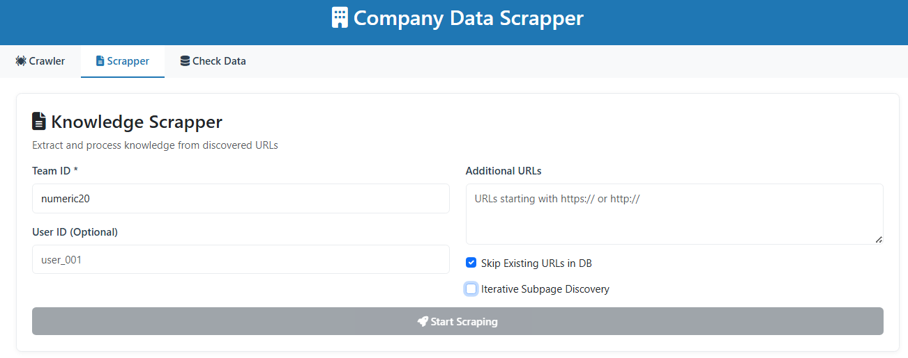

# Company Crawler & Scrapper

[](https://youtu.be/o__WmIZd0x8)

**App is hosted at: [https://data-scrapper.up.railway.app](https://data-scrapper.up.railway.app)**

A modern application to discover, crawl, and extract structured knowledge from company websites. It provides a user-friendly web interface for extracting company information, discovering related URLs, blogs, and technical content, and organizing the results for further analysis.

## Features

- **Company Crawler**: Crawls a company website to find all internal pages, blogs, and related URLs.
- **Company Info Extraction**: Extracts company name, description, industry, founders, key people, and social media links using LLMs or fallback methods.
- **Founder Discovery**: Finds founders via web search and on-site analysis.
- **Blog & External Mention Discovery**: Identifies blog posts, founder blogs, and external mentions using Google Search API and LLMs.
- **Knowledge Scrapper**: Scrapes and processes technical content from discovered URLs, supporting HTML, PDF, and plain text.
- **Database Integration**: Stores extracted knowledge in a MongoDB database for search and statistics.
- **Modern Web UI**: Elegant Flask-based interface for running crawls, scrapes, and viewing results.

## Demo Team IDs

You can check existing data for the following team IDs:

- `aline123`
- `groove123`


## Demo: Example Run

Follow these steps for a typical workflow using the web UI:

1. **Open Crawler and Add Company Webpage**

   - Enter the company website URL (e.g., `https://www.numeric.io/`) and specify a team ID (e.g., `numeric20`).
   - 
2. **Go to Scrapper and Add Team ID**

   - Enter the same team ID (`numeric20`).
   - Ensure **Iterative Subdirectory Discovery** is turned **on**.
   - 
   - **Note:** This process may take a long time, as the scrapper will visit and extract data from many web pages.

3. **Return to Crawler and Enable External URL Search**

   - Turn **off** the "Skip external URL search" option.
   - Repeat the crawl with the same parameters.
   - 
4. **Go to Scrapper and Turn Off Iterative Subdirectory Discovery**

   - In Scrapper, turn **off** the **Iterative Subdirectory Discovery** option and start the scrape.
   - 
   - **Note:** This process may take a long time, as the scrapper will visit and extract data from many web pages.
   
5. **This step will yield nearly all the detailed technical information available about the company.**

---

## How to Run (Web UI)

1. Install dependencies:
   ```bash
   pip install -r requirements.txt
   ```
2. Start the UI:
   ```bash
   python UI/run_ui.py
   ```
3. Open [http://localhost:5000](http://localhost:5000) in your browser.


## Environment Variables (.env)

Create a `.env` file in the root directory with the following variables:

```env
GOOGLE_API_KEY=your_google_api_key_here
GOOGLE_CSE_ID=your_google_custom_search_engine_id_here
GEMINI_API_KEY=your_gemini_api_key_here
GEMINI_MODEL=gemini-2.0-flash-lite

# MongoDB Configuration
MONGODB_URI=mongodb+srv://sh.2uayc9a.mongodb.net/
MONGODB_DATABASE=your_database_name_here
MONGODB_COLLECTION=your_collection_name_here
```
